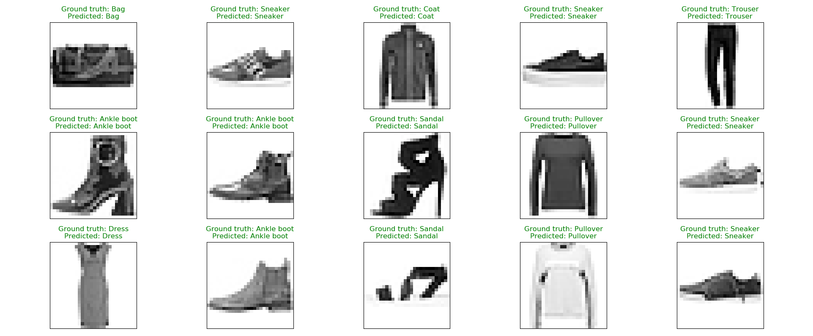

# CNN-Zalandos-Fashion-MNIST-Dataset
In this replository a small Convolutional Neural Network is build to predict which kind of clothing 
(T-shirt/top, Trouser, Pullover, etc.) is shown on a given picture.   The dataset is Zalando's Fashion-MNIST consisting of a 
training set of 60,000 examples and a test set of 10,000 examples. Each example is a 28x28 grayscale image, associated with a 
label from 10 classes.

**See [notebook.ipynb](https://github.com/bergmatics/CNN-Zalandos-Fashion-MNIST-Dataset/blob/master/notebook.ipynb) for explanation of the code.** :alien:
